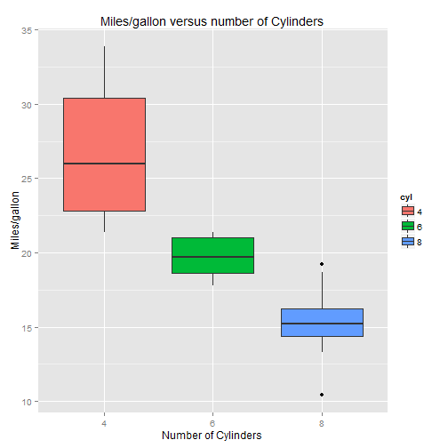

## Take a look at this graph

Data - comprises of fuel consumption and performance for 32 automobiles (1973-74 models)

 

---
## What does the graph tells you?

> 1. Higher number of cylinders give more Miles per Gallon
> 2. Higher number of cylinders give less Miles per Gallon
> 3. No relations

--- &radio
## From the options provided in the previous slide, which one was correct?

1. 1
2. _2_
3. 3

*** .hint
More number of cylinders means more weight to carry

*** .explanation
The boxplot shows that as the number of cylinders goes up, the miles/gallon drops

---
## Data source

Motor Trend Car Road Tests data comprises of fuel consumption and performance for 32 automobiles. The data was extracted from the 1974 Motor Trend US magazine.

Thank you!

